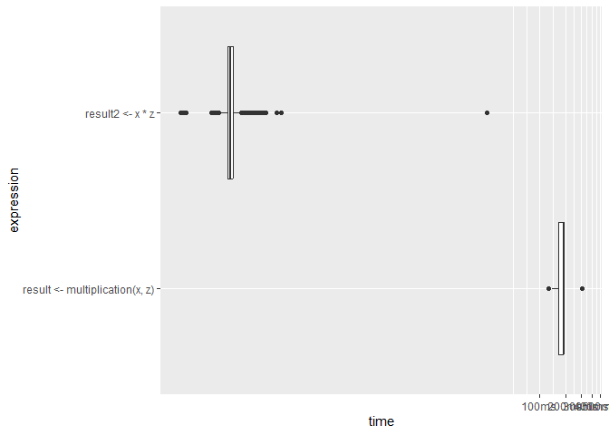

Software - Programming with (Big) Data
================
qus7tm
2024-10-14

``` r
pacman::p_load(
        rio,            # import and export files
        here,           # locate files 
        tidyverse,      # data management and visualization
        microbenchmark, # measure R performance
        bench,          # measure R performance
        pryr,           # measure R performance
        profvis,        # measure R performance
        lobstr,         # get memory address
        lubridate
)
```

## Measure R performance

``` r
# R performance #-------------------
```

How much time does it take to run this loop?

``` r
# slightly different for every run
system.time(for (i in 1:100) {i + 5})
```

    ##    user  system elapsed 
    ##       0       0       0

``` r
# run multiple time --> provide statistics of run time
microbenchmark(for (i in 1:100) {i + 5})
```

    ## Unit: microseconds
    ##                            expr     min       lq   mean  median       uq      max neval
    ##  for (i in 1:100) {     i + 5 } 747.901 774.4505 856.98 797.051 817.0505 5517.801   100

Object size

``` r
hello <- "Hello, World!"
object.size(hello)
```

    ## 120 bytes

``` r
# `character` takes more memory than `factor`
# initialize a large string vector containing letters
large_string <- rep(LETTERS[1:20], 1000^2)
head(large_string)
```

    ## [1] "A" "B" "C" "D" "E" "F"

``` r
# store the same information as a factor in a new variable
large_factor <- as.factor(large_string)

# is one bigger than the other?
object.size(large_string) - object.size(large_factor)
```

    ## 79999456 bytes

`pryr::mem_change()`: how different parts of script affect the overall
memory occupied by R

``` r
# vector with 1000 (pseudo)-random numbers
mem_change(thousand_numbers <- runif(1000))
```

    ## 13.4 kB

``` r
# vector with 1M (pseudo)-random numbers
mem_change(a_million_numbers <- runif(1000^2))
```

    ## 8 MB

`bench::mark()`: compare performance of different code (timing + memory
usage)

``` r
# variables
x <- 1:10000
z <- 1.5

# approach I: loop
multiplication <- 
        function(x,z) {
                result <- c()
                for (i in 1:length(x)) {result <- c(result, x[i]*z)}
                return(result)
        }
result <- multiplication(x,z)
head(result)
```

    ## [1] 1.5 3.0 4.5 6.0 7.5 9.0

``` r
# approach II: "R-style"
result2 <- x * z 
head(result2)
```

    ## [1] 1.5 3.0 4.5 6.0 7.5 9.0

``` r
# comparison
benchmarking <- 
        mark(
                result <- multiplication(x,z),
                result2 <- x * z, 
                min_iterations = 50 
        )
benchmarking[, 4:9]
```

    ## # A tibble: 2 × 3
    ##   `itr/sec` mem_alloc `gc/sec`
    ##       <dbl> <bch:byt>    <dbl>
    ## 1      6.58     382MB    34.5 
    ## 2  35141.      78.2KB     3.51

``` r
# visualize output
plot(benchmarking, type = "boxplot")
```

<!-- -->

`profvis:profvis()`: analyze performance of several lines of code

``` r
# profvis({
#         x <- 1:10000
#         z <- 1.5
#         
#         # approach I: loop
#         multiplication <- 
#                 function(x,z) {
#                         result <- c()
#                         for (i in 1:length(x)) {result <- c(result, x[i]*z)}
#                         return(result)
#                 }
#         result <- multiplication(x,z)
#         
#         # approach II: "R-style"
#         result2 <- x * z 
#         head(result2) 
# })
```

Check memory address

``` r
a <- 15
obj_addr(a)
```

    ## [1] "0x221e0755750"

``` r
b <- a
obj_addr(b)
```

    ## [1] "0x221e0755750"

## SQL basics

``` r
# SQL basics #-------------------

(econ <- rio::import("https://bda-examples.s3.eu-central-1.amazonaws.com/economics.csv") %>%
        tibble())
```

    ## # A tibble: 574 × 6
    ##    date         pce    pop psavert uempmed unemploy
    ##    <IDate>    <dbl>  <int>   <dbl>   <dbl>    <int>
    ##  1 1967-07-01  507. 198712    12.5     4.5     2944
    ##  2 1967-08-01  510. 198911    12.5     4.7     2945
    ##  3 1967-09-01  516. 199113    11.7     4.6     2958
    ##  4 1967-10-01  513. 199311    12.5     4.9     3143
    ##  5 1967-11-01  518. 199498    12.5     4.7     3066
    ##  6 1967-12-01  526. 199657    12.1     4.8     3018
    ##  7 1968-01-01  532. 199808    11.7     5.1     2878
    ##  8 1968-02-01  534. 199920    12.2     4.5     3001
    ##  9 1968-03-01  545. 200056    11.6     4.1     2877
    ## 10 1968-04-01  545. 200208    12.2     4.6     2709
    ## # ℹ 564 more rows

``` r
(inflation <- rio::import("https://bda-examples.s3.eu-central-1.amazonaws.com/inflation.csv") %>%
        tibble())
```

    ## # A tibble: 61 × 2
    ##    date       inflation_percent
    ##    <IDate>                <dbl>
    ##  1 1960-01-01              1.46
    ##  2 1961-01-01              1.07
    ##  3 1962-01-01              1.20
    ##  4 1963-01-01              1.24
    ##  5 1964-01-01              1.28
    ##  6 1965-01-01              1.59
    ##  7 1966-01-01              3.02
    ##  8 1967-01-01              2.77
    ##  9 1968-01-01              4.27
    ## 10 1969-01-01              5.46
    ## # ℹ 51 more rows

### R example

``` r
## R example #---------------------
# remove observations older than a certain date --> compute yearly averages
econ %>%
        filter(date >= "1968-01-01") %>%
        mutate(year = lubridate::year(date)) %>%
        group_by(year) %>%
        summarise(avg_unemploy = mean(unemploy))
```

    ## # A tibble: 48 × 2
    ##     year avg_unemploy
    ##    <dbl>        <dbl>
    ##  1  1968        2797.
    ##  2  1969        2830.
    ##  3  1970        4127.
    ##  4  1971        5022.
    ##  5  1972        4876.
    ##  6  1973        4359.
    ##  7  1974        5173.
    ##  8  1975        7940.
    ##  9  1976        7398.
    ## 10  1977        6967.
    ## # ℹ 38 more rows

``` r
# create dataframe with year, average_unemp_percent, and inflation_percent
(df1 <- econ %>%
        mutate(year = year(date)) %>%
        group_by(year, pop) %>%
        summarise(unemp_percent = unemploy/pop*100) %>%
        group_by(year) %>%
        summarise(average_unemp_percent = mean(unemp_percent)))
```

    ## `summarise()` has grouped output by 'year'. You can override using the `.groups` argument.

    ## # A tibble: 49 × 2
    ##     year average_unemp_percent
    ##    <dbl>                 <dbl>
    ##  1  1967                  1.51
    ##  2  1968                  1.39
    ##  3  1969                  1.40
    ##  4  1970                  2.01
    ##  5  1971                  2.42
    ##  6  1972                  2.32
    ##  7  1973                  2.06
    ##  8  1974                  2.42
    ##  9  1975                  3.68
    ## 10  1976                  3.39
    ## # ℹ 39 more rows

``` r
(df2 <- inflation %>%
        filter(date >= "1967-01-01", date <= "2015-01-01") %>%
        mutate(year = year(date)) %>%
        select(year, inflation_percent))
```

    ## # A tibble: 49 × 2
    ##     year inflation_percent
    ##    <dbl>             <dbl>
    ##  1  1967              2.77
    ##  2  1968              4.27
    ##  3  1969              5.46
    ##  4  1970              5.84
    ##  5  1971              4.29
    ##  6  1972              3.27
    ##  7  1973              6.18
    ##  8  1974             11.1 
    ##  9  1975              9.14
    ## 10  1976              5.74
    ## # ℹ 39 more rows

``` r
df1 %>% left_join(df2)
```

    ## Joining with `by = join_by(year)`

    ## # A tibble: 49 × 3
    ##     year average_unemp_percent inflation_percent
    ##    <dbl>                 <dbl>             <dbl>
    ##  1  1967                  1.51              2.77
    ##  2  1968                  1.39              4.27
    ##  3  1969                  1.40              5.46
    ##  4  1970                  2.01              5.84
    ##  5  1971                  2.42              4.29
    ##  6  1972                  2.32              3.27
    ##  7  1973                  2.06              6.18
    ##  8  1974                  2.42             11.1 
    ##  9  1975                  3.68              9.14
    ## 10  1976                  3.39              5.74
    ## # ℹ 39 more rows

``` r
# rmarkdown::render()
```
